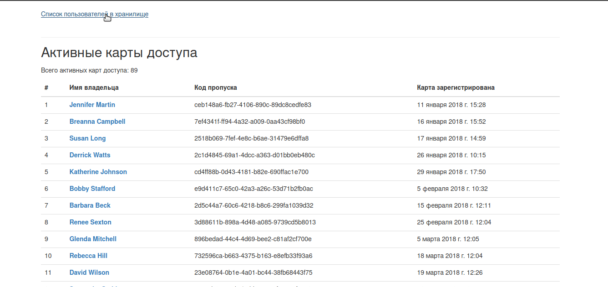

# Мини-сайтик для охранника банка

Сайт показывает кто сейчас в хранилище с деньгами, сколько раз сотрудники ходили в хранилище, а если кто-то украл деньги — с кем он там был. 




## Что используется

- Подключение к базе данных.
- Запросы к базе данных.
- Обработка запросов и передача фронтенду.


## Установка

- Клонируйте репозиторий:
```
git clone https://github.com/ArkJzzz/django-orm-watching-storage
```

- Создайте файл ```.env``` и поместите в него данные для подключения к базе данных:
```
DATABASE_ENGINE=<django.db.backends.postgresql_psycopg2>
DATABASE_HOST=<хост>
DATABASE_PORT=<порт>
DATABASE_NAME=<имя базы данных>
DATABASE_USER=<имя пользователя>
DATABASE_PASSWORD=<пароль>
```

- Установите зависимости:
```
pip3 install -r requirements.txt
```

## Запуск

```
python3 main.py
```

Cайт будет доступен по адресу: [http://0.0.0.0:8000/](http://0.0.0.0:8000/)


- **Как запускать на сервере**

    - шпаргалка по деплою на [Heroku](https://github.com/ArkJzzz/heroku_deploy)
    - шпаргалка по деплою на [удаленном сервере с Ubuntu](https://github.com/ArkJzzz/remote_server_deploy.git)

------

